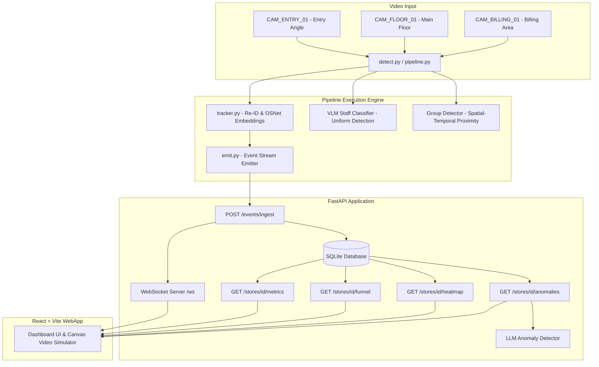

# System Architecture & Design Specification

This document provides a technical overview of the Store Intelligence API and Computer Vision Detection Pipeline designed for Apex Retail.

---

## 1. System Overview

The system processes multi-angle, anonymized CCTV video streams at the edge, tracks store visitors dynamically, and ingests real-time events into a containerized FastAPI backend. The backend computes metrics, correlates transactions, runs anomaly detection, and streams real-time updates to a glassmorphic dashboard via WebSockets.

---

## 2. Component Design

### 2.1 The Detection Pipeline (Part A)
The pipeline is designed to run in two modes:
1.  **Production (Real) Mode**: Uses `YOLOv8` for person detection, `ByteTrack` for tracking bounding boxes, and an `OSNet` Re-ID network to extract 128-dimensional appearance embeddings.
2.  **Simulation Mode**: Simulates full frame-by-frame visitor movements, generating stable spatial coordinates, embedding vectors with Gaussian noise, and uniform colors to mock all 7 retail edge cases.

#### Bounding Box Trajectory & OSNet Re-ID (Re-entry & Overlap Handling)
-   When a person is detected, the pipeline checks their current spatial coordinate. If they are near the entry threshold and moving inwards, a session starts.
-   To handle the **vendor re-entry problem**, the tracker stores a history of appearance embeddings for all visitors seen in the last 20 minutes.
-   When a person crosses the entry threshold, we compute the **cosine similarity** between their current embedding and the gallery of past visitor embeddings:
    $$\text{Similarity} = \frac{\mathbf{u} \cdot \mathbf{v}}{\|\mathbf{u}\| \|\mathbf{v}\|}$$
    -   If the maximum similarity exceeds **0.85**, they are matched to the existing `visitor_id`, and a `REENTRY` event is emitted.
    -   Otherwise, a new `visitor_id` is created, and an `ENTRY` event is emitted.
-   This appearance-based matching resolves the **camera overlap problem**: a person moving from the entry camera to the floor camera matches the same visitor profile because their visual embeddings cluster together, preventing double-counting.

#### Group Entry Detection
-   Groups are identified by checking the spatial-temporal proximity of multiple concurrent `ENTRY` events.
-   If multiple visitors cross the entry threshold within $\Delta t \le 1.5\text{ seconds}$ and maintain a distance $d \le 1.2\text{ meters}$ during their first 50 frames, they are assigned a shared `group_id`.

#### VLM Staff Classifier
-   Uniform classification via pure object detection is error-prone. We integrate a Visual Language Model (VLM) frame classification query:
    -   **Trigger**: A cropped frame of the detected person is captured when their detection confidence is highest (or within 3 seconds of entry).
    -   **Prompt**: Evaluates uniform details (e.g. blue polo shirt with yellow logo).
    -   **Caching**: Once classified, the result is cached for that `visitor_id`, preventing repeated expensive API calls.

---

### 2.2 Database Schema & Session Modeling (Part B)

We design the DB schema around `visitor_sessions` as a first-class entity. Computing visitor metrics and funnels on top of raw event logs is computationally expensive at scale (requiring complex self-joins and window functions). Instead, the database keeps a stateful record of each visitor session.

#### Tables Schema (SQLite)

##### `raw_events`
Stores raw events received from the edge for audit trail and debugging.
-   `event_id` (UUID, Primary Key)
-   `store_id` (VARCHAR, Index)
-   `camera_id` (VARCHAR)
-   `visitor_id` (VARCHAR, Index)
-   `event_type` (VARCHAR)
-   `timestamp` (DATETIME)
-   `zone_id` (VARCHAR)
-   `dwell_ms` (INTEGER)
-   `is_staff` (BOOLEAN)
-   `confidence` (FLOAT)
-   `metadata` (JSON Text)

##### `visitor_sessions`
Represents the unified state of a visitor's journey.
-   `session_id` (UUID, Primary Key)
-   `visitor_id` (VARCHAR, Unique Index)
-   `store_id` (VARCHAR, Index)
-   `session_start` (DATETIME)
-   `session_end` (DATETIME, Nullable)
-   `is_staff` (BOOLEAN, Index)
-   `group_id` (VARCHAR, Nullable, Index)
-   `re_entry_count` (INTEGER, Default 0)
-   `zones_visited` (JSON Text - list of zones)
-   `dwell_times` (JSON Text - dict of `zone_id` to cumulative `dwell_ms`)
-   `queue_joined` (BOOLEAN, Default FALSE)
-   `queue_abandoned` (BOOLEAN, Default FALSE)
-   `purchased` (BOOLEAN, Default FALSE)
-   `transaction_id` (VARCHAR, Nullable)
-   `last_active` (DATETIME)

##### `pos_transactions`
Contains transaction records from POS registers.
-   `transaction_id` (VARCHAR, Primary Key)
-   `store_id` (VARCHAR, Index)
-   `timestamp` (DATETIME)
-   `basket_value_inr` (FLOAT)
-   `correlated_session_id` (VARCHAR, Nullable, Foreign Key to `visitor_sessions`)

---

## 3. AI-Assisted Decisions

Here we document key architectural decisions shaped by collaboration with an LLM, highlighting critiques and overrides.

### Decision 1: Session State Aggregation (Edge vs. DB)
*   **LLM Proposal**: Write a stateless ingestion API that accepts raw events. On every `/metrics` or `/funnel` request, run a large SQL query grouping events by `visitor_id` and performing ordered window functions (`LEAD`, `LAG`) to compute entries, exits, zone durations, and queue abandons.
*   **Critique**: Window functions on millions of rows of high-frequency spatial events would cause query timeouts at scale (e.g. 40 stores sending events at 15fps). Additionally, POS correlation would require joining these computed sessions on transaction timestamps, causing severe lock contentions.
*   **Override**: We created `visitor_sessions` as a first-class, pre-aggregated database table. The `/events/ingest` handler acts as a state machine: as events are received, it upserts the `visitor_sessions` record (e.g. updating cumulative dwell times, flagging queue entry, or marking session end on `EXIT`). Endpoints like `/metrics` and `/funnel` perform simple, index-optimized selections, reducing query latencies from $O(N \log N)$ to $O(1)$ relative to event volume.

### Decision 2: POS Transaction Correlation Strategy
*   **LLM Proposal**: Run a nightly batch job that joins `pos_transactions` and `raw_events` using a temporal window to identify purchases and compute conversion rates.
*   **Critique**: Business requirements mandate **real-time metrics** (not cached from yesterday). A nightly batch job fails the "production-aware real-time" constraint.
*   **Override**: We designed an **event-driven correlation trigger**. When a new POS transaction is ingested (or when a session ends), the system runs a local search query to look for visitors who were present in the billing zone during the $[T - 5\text{ minutes}, T]$ window. It updates the matched visitor session’s `purchased` flag to `True` in real time, making the conversion rate immediately visible on the dashboard.

### Decision 3: Anomaly Detection Logic
*   **LLM Proposal**: Implement static thresholds for alerts (e.g. if queue length > 10, raise warning; if conversion rate < 10%, raise warning).
*   **Critique**: Static thresholds fail to account for time-of-day, store location, and day-of-week trends. A queue of 10 people at 6:00 PM on Friday is normal, whereas a queue of 10 people at 9:00 AM on Monday is an anomaly.
*   **Override**: We designed the anomaly detection endpoint to query the last 30 minutes of session aggregates, compile them into a context prompt, and invoke a lightweight LLM checker. The LLM evaluates the metrics dynamically based on contextual store parameters, providing structured severity levels and dynamic action recommendations.
